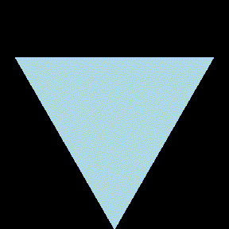

# Reel

[](https://travis-ci.org/shashi/Reel.jl)

*Film computations*

<p align="center">
    
</p>

## Quickstart

### Installation
```julia
Pkg.add("Reel")
```

This package now relies on [FFMPEG.jl](https://github.com/JuliaIO/FFMPEG.jl). For versions lower than 1.2 you will need `ffmpeg` and `imagemagick` installed to use Reel. This package supersedes [ComposeVideo.jl](https://github.com/arnim/ComposeVideo.jl)

### Usage

Reel exports the all-important function `roll` which you can use to roll the camera on various arguments:

```julia
using Reel
using Plots

function render(t, dt)
    # t is the time into the sequence
    # dt is the time to advance for the next frame

    # any expression that results in an object which can be
    # rendered as png or jpg
    plot([x -> sin(x+t*π), x -> cos(x+t*π)], 0, 6)
end

film = roll(render, fps=30, duration=2)

write("output.gif", film) # Write to a gif file

# Or
write("file.webm", film) # Write to a webm video

# Or
write("file.mp4", film)  # An mp4 formatted video
```
<p align="center">
    
</p>

The same thing can be concisely written with Julia's do syntax:

```julia
film = roll(fps=30, duration=2) do t, dt
    plot([x -> sin(x+t*π), x -> cos(x+t*π)], 0, 6)
end

write("output.gif", film)
```

Note that the fps you specify to `roll` will be enforced no matter how long the computation actually takes: you set the speed at which you want to watch it.

Reel can also render an abstract array of objects:

```julia
using Compose
import Cairo, Fontconfig

Compose.set_default_graphic_size(3inch, 3inch) # Square

# draw a regular n-gon
ngon(n) = compose(context(units=UnitBox(-1, -1, 2, 2)), fill("lightblue"),
                polygon([(cos(x), sin(x)) for x in π/2:2π/n:3.5π]))

roll(map(ngon, vcat(3:10, 9:-1:3)), fps=5)
```

<p align="center">
    
</p>


Reel exports `Frames`, a type for a collection of frames.

`Frames` constructor takes a MIME type of the frames, and the fps at which the animation should be rendered. e.g.

You can push a new frames to a `Frames` object using `push!`.

```julia
# A Glider gun from Conway's game of Life

using Reel
frames = Frames(MIME("image/png"), fps=2)

g = glider_gun # initial board state
for i=1:31
    push!(frames, draw(g))
    g = decidefate(g)
end

frames

```

<p align="center">
    
</p>

You can render a `Frames` object as usual:

```julia
write("output.webm", frames)
```

## In IJulia

A call to `roll` returns a `Frames` object. A method `writemime(::IO, ::MIME{symbol("text/html"),::Frames)` orchestrates the rendering of a `Frames` object in IJulia. Any cell which results in a `Frames` results in the animation being rendered. By default, a webm video is generated. You can change this behavior:

```julia
Reel.set_output_type("gif") # or "mp4"
```

## They see me rollin', they hatin'

```julia
# particles in a box.

using Color, Compose

box(x) = let i = floor(x)
    i%2==0 ? x-i : 1+i-x
end

colors = distinguishable_colors(10, lchoices=[82.])

dots(points) = [(context(p[1], p[2], .03, .03), fill(colors[i%10+1]), circle())
    for (i, p) in enumerate(points)]

velocities = [(rand(), rand()) for i in 1:40]

roll(fps=30, duration=10.0) do t, dt

    compose(context(),
            dots([map(v -> box(v*t + 0.5), (vx, vy)) for (vx, vy) in velocities])...)
end

```
<p align="center">
    
</p>

```julia
# Solution of Helmholtz equation with Dirichlet BC using ApproxFun

using ApproxFun

B=dirichlet(d)
Δ=lap(d)

plots = [ApproxFun.contour(pdesolve([B,Δ+k*I],ones(4),150))
            for k=vcat([1:1.0:100], [99:-1.0:1])]

roll(plots, fps=24)

# Warning: this gif is 8 mb!
```

<p align="center">
    
</p>

---

<p align="center">
    <em>Fin.</em>
</p>
